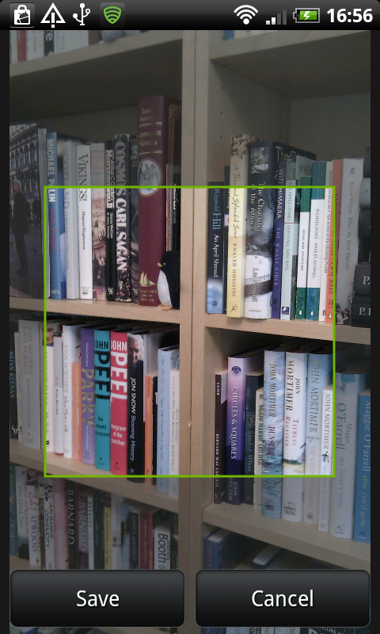
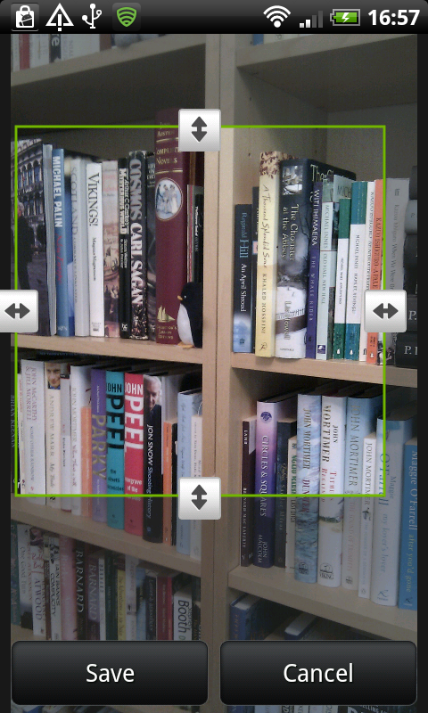
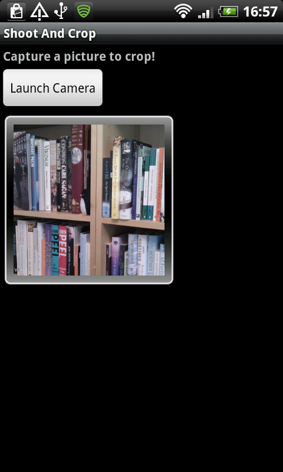

Capture and Crop an Image with the Device Camera
=======================

Capturing an image using the Android camera and then cropping it using apps the user already has installed on their device.

A direct port of [Capture and crop with camera](http://cdn.tutsplus.com/mobile/authors/legacy/Sue%20Smith/2012/07/10/Capturing_and_Cropping_an_Image_with_the_Android_Camera.zip) for C# to work with [Xamarin.Android](http://www.xamarin.com/)

Thanks to
---------
* [Sue Smith](http://tutsplus.com/authors/sue-smith) - The blog writer of [Capture and crop with camera](http://code.tutsplus.com/tutorials/capture-and-crop-an-image-with-the-device-camera--mobile-11458)

License
-------
Just like the original this port is licensed under Apache 2.0.
    
    Copyright 2014 Mobmaxime
    
    Licensed under the Apache License, Version 2.0 (the "License");
    you may not use this file except in compliance with the License.
    You may obtain a copy of the License at
    
    http://www.apache.org/licenses/LICENSE-2.0
    
    Unless required by applicable law or agreed to in writing, software
    distributed under the License is distributed on an "AS IS" BASIS,
    WITHOUT WARRANTIES OR CONDITIONS OF ANY KIND, either express or implied.
    See the License for the specific language governing permissions and
    limitations under the License.

