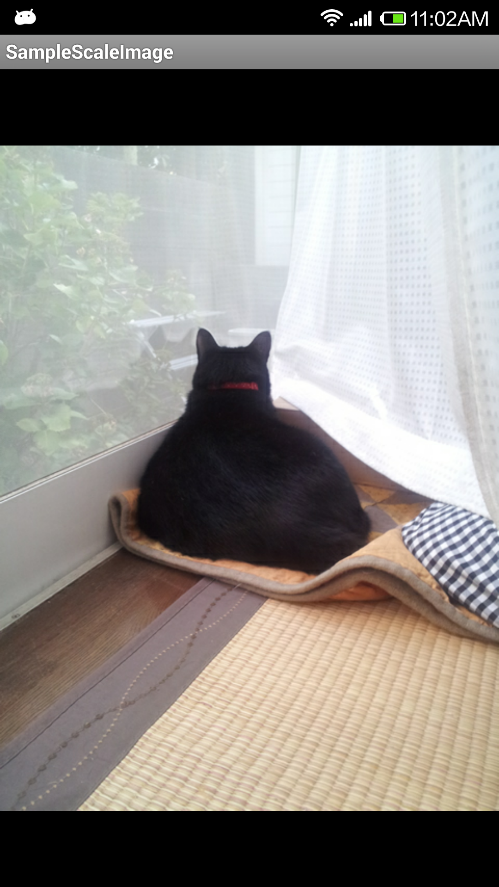
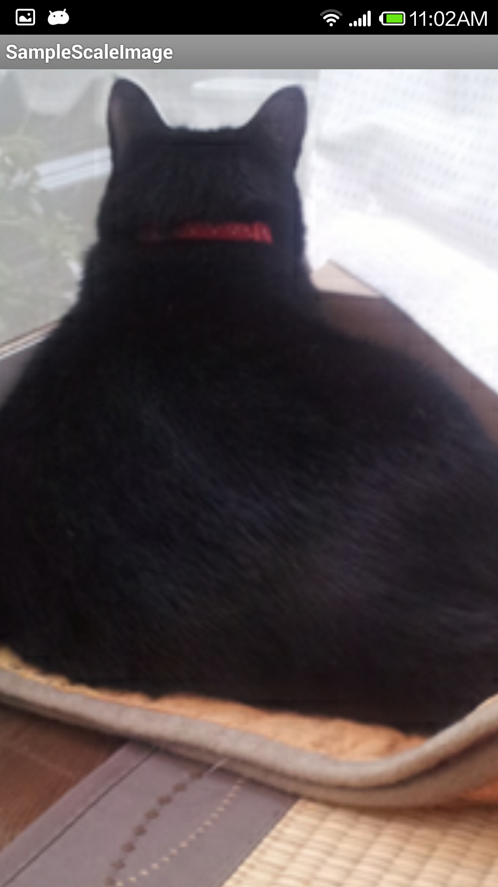

 Pinch In and Out Xamarin.Android
=======================

A Pinch-in and pinch-out function to Android ImageView for Xamarin Android.

A direct port of [scale-imageview-android](https://github.com/matabii/scale-imageview-android) for C# to work with [Xamarin.Android](http://www.xamarin.com/)

Thanks to
---------
* [Ishii Kenzo](https://github.com/matabii) - The creator of [scale-imageview-android](https://github.com/matabii/scale-imageview-android)

License
-------
Just like the original this port is licensed under Apache 2.0.
    
    Copyright 2014 Mobmaxime
    
    Licensed under the Apache License, Version 2.0 (the "License");
    you may not use this file except in compliance with the License.
    You may obtain a copy of the License at
    
    http://www.apache.org/licenses/LICENSE-2.0
    
    Unless required by applicable law or agreed to in writing, software
    distributed under the License is distributed on an "AS IS" BASIS,
    WITHOUT WARRANTIES OR CONDITIONS OF ANY KIND, either express or implied.
    See the License for the specific language governing permissions and
    limitations under the License.

